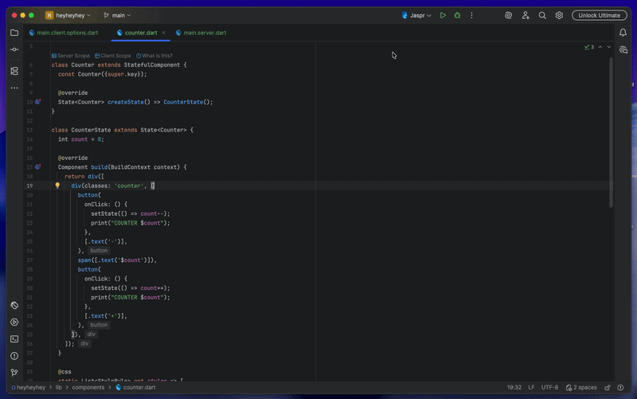
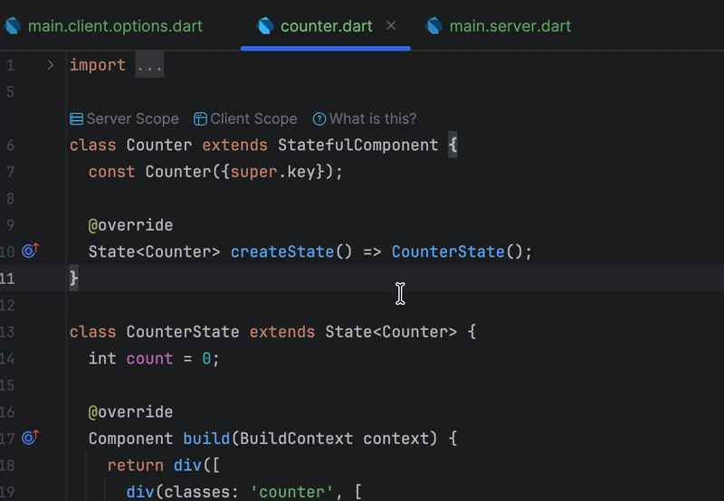
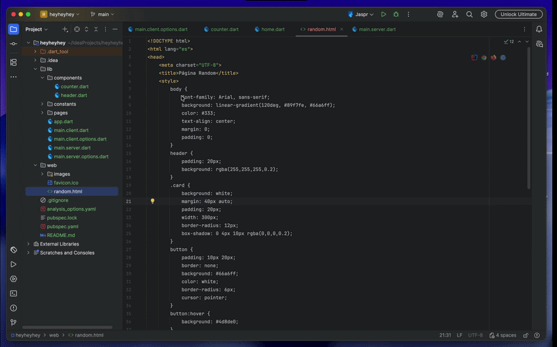

# jaspr_intellij

## Overview

**jaspr_intellij** is a free and open-source IntelliJ IDEA plugin that adds first-class development support for the [Jaspr](https://github.com/schultek/jaspr) framework.

## Features

### 🚀 Run & Debug
Runs `jaspr daemon` directly from the IDE run configuration, with full lifecycle management (graceful shutdown, Chrome cleanup).
- **Formatted Console:** CLI, builder, server, and client log lines are colour-coded and separated by source.
- 

### 🧩 Component Scopes
Connects to the `jaspr tooling-daemon` in the background when a Jaspr project is opened.
- **Inlay Hints:** Displays inline editor hints indicating whether a component is rendered on the server or the client.
- 

### 🪄 HTML to Jaspr Conversion
Instantly migrate your existing HTML templates to Jaspr components.
- **Right-click Conversion:** Right-click any `.html` file in the project view and select "Convert to Jaspr".
- **Auto-scaffolding:** Generates a new Dart file with the converted Jaspr code wrapped in a `StatelessComponent`.
- 

### 🆕 Project & File Templates
- **New Project Wizard:** Scaffold a Jaspr app from scratch with full CLI configuration.
- **File Templates:** Create new `StatelessComponent`, `StatefulComponent`, and `InheritedComponent` files.

### ⌨️ Live Code Snippets
- `stlessc` — new `StatelessComponent` class
- `stfulc` — new `StatefulComponent` class
- `inhc` — new `InheritedComponent` class
- `jhtml` — html component
- `jtext` — text component
- `jstyls` — style sheet
- `jevt` — generic event handler
- `jclick` — click event handler

### 🛠️ Tooling
- **Maintenance:** Clean and Doctor commands available from the IDE.
- **Daemon Status:** Check the connectivity and health of the Jaspr tooling daemon.
- **Version Check:** Notification when `jaspr_cli` and `pubspec.yaml` versions differ.
- **Update CLI:** Easily update the Jaspr CLI from the Tools menu.
- **Inspections:** Detect common errors, such as multiple scope annotations on the same component.

## Roadmap

- [x] Run configuration with `jaspr daemon` and formatted console output.
- [x] Component Scopes via `jaspr tooling-daemon`.
- [x] New Project wizard.
- [x] Live code snippets.
- [x] Clean and Doctor commands.
- [x] Debugger attachment to server and client VM services.
- [x] HTML → Jaspr conversion via `jaspr tooling-daemon`.

## Installation

- **Marketplace:** <kbd>Settings</kbd> > <kbd>Plugins</kbd> > <kbd>Marketplace</kbd> > search for `jaspr_intellij`
- **Manual:** download the [latest release](https://github.com/ELadrimonos/jaspr_intellij/releases/latest) and install via <kbd>Settings</kbd> > <kbd>Plugins</kbd> > <kbd>⚙️</kbd> > <kbd>Install plugin from disk…</kbd>

---
This plugin is independent and not affiliated with Jaspr, Flutter, Dart, Google, or JetBrains.
